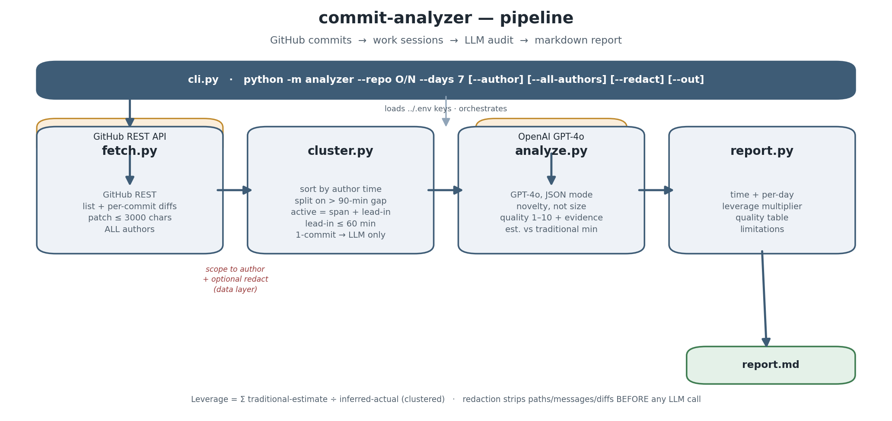

# commit-analyzer

A CLI that pulls a developer's GitHub commits over a time window and produces a
markdown report on **(a) code quality** and **(b) estimated active hours** —
assuming the developer leans heavily on AI coding tools, so time is judged by the
*novelty* of a change, not its size.



## How it works

| Stage | Module | What it does |
|---|---|---|
| 1. Fetch | `fetch.py` | GitHub REST: list commits `since`, then per-commit file stats + patch. Every patch is truncated to **3000 chars** before leaving the module so lockfiles/generated code can't blow up context. Pulls **all** authors. |
| 2. Cluster | `cluster.py` | The time-estimation core. Sort commits by author time; start a new **session** on any gap **> 90 min**. Session active time = last − first commit, **+ an LLM lead-in (capped 60 min)** for the invisible work before the first commit. Single-commit sessions have no span, so they fall back to a pure LLM estimate. |
| 3. Analyze | `analyze.py` | One **GPT-4o** call per commit (`response_format=json_object`, retry once). Returns quality (1–10 + strengths/issues/evidence), complexity, `estimated_active_minutes`, and `traditional_estimate_minutes` (a no-AI dev). One aggregate call adds a weekly summary + top-3 recommendations. |
| 4. Report | `report.py` | Renders `report.md`: time summary, **leverage multiplier**, quality table with evidence, recommendations, and a plain-spoken limitations section. |
| 5. CLI / redact | `cli.py` | Wires it together; scopes analysis to one author; `--redact` masks data **before** the LLM call. |

**Leverage metric:** `Σ traditional_estimate_minutes ÷ inferred-actual (clustered)` —
how much faster the work landed than a solo dev without AI tooling would manage.

## Setup

Python 3.11+ via conda on WSL/Ubuntu. Create and activate a dedicated env, then
install deps with `pip` inside it:

```bash
conda create -n commit-analyzer python=3.11 -y
conda activate commit-analyzer
pip install -r requirements.txt
```

### Credentials

Keys are read from a **shared parent env file**, one level *above* this repo
(`secondtalent/.env`), so sibling projects can share credentials — **not** from
the repo's own directory. Copy the template there and fill it in:

```bash
cp .env.example ../.env
$EDITOR ../.env          # set GITHUB_TOKEN and OPENAI_API_KEY
```

- `GITHUB_TOKEN` — raises the API limit to 5000/hr and enables private repos.
- `OPENAI_API_KEY` — used for GPT-4o.

The tool fails loudly if either is missing. The path resolves relative to the
package (not your CWD); override it with `COMMIT_ANALYZER_DOTENV=/path/to/.env`.
`.env` is gitignored — only `.env.example` is committed.

## Usage

```bash
python -m analyzer --repo owner/name [--repo owner/name2] --days 7 \
    [--author <login>] [--all-authors] [--redact] [--out report.md]
```

| Option | Default | Meaning |
|---|---|---|
| `--repo` | *(required, repeatable)* | `owner/name` to analyze. |
| `--days` | `7` | Look-back window. |
| `--author` | the authenticated GitHub user | Scope analysis to one author (login / email / name). The fetcher pulls everyone; analysis (hours, quality, leverage) is **yours** unless told otherwise. |
| `--all-authors` | off | Analyze every contributor instead. |
| `--redact` | off | Mask paths (keep extension), withhold messages, drop patches, skip evidence — **at the data layer, before the LLM call**. |
| `--out` | `report.md` | Output path. |
| `--model` | `gpt-4o` | OpenAI model. |

### Examples

```bash
# Your last week on one repo (clear text)
python -m analyzer --repo vincentkho67/commit-analyzer

# Two repos, 14 days, privacy mode
python -m analyzer --repo me/api --repo me/web --days 14 --redact

# A specific teammate on a shared repo
python -m analyzer --repo org/service --author alice --out alice.md
```

## Multi-contributor awareness

The fetcher always pulls **all** commits; analysis then scopes to one author so
your numbers are genuinely yours. On a shared repo the filter narrows real data —
e.g. the last 100 commits of `cli/cli` span 6 authors, and `--author babakks`
keeps 65 of 100 (35 by others). Use `--all-authors` to audit the whole team.

## Output

See [`sample_output.md`](sample_output.md) for a clear-text run of this tool
against its own repo. The report contains:

- **Header** — repos, window, commit & session counts.
- **Time summary** — inferred active hours, per-day breakdown, session table
  (span, lead-in, active).
- **AI leverage** — traditional vs. inferred-actual, as a multiplier.
- **Quality** — weekly average, per-commit table, evidence quoted from diffs.
- **Recommendations** — aggregate top 3.
- **Limitations** — what the tool genuinely cannot know (squashed commits,
  end-of-session committing, amended timestamps, invisible thinking time, the
  lead-in estimate).

## Project layout

```
analyzer/
  fetch.py      # GitHub commits + diffs (patch truncation)
  cluster.py    # session clustering — the time-estimation core
  analyze.py    # GPT-4o quality + time estimation
  report.py     # markdown report
  cli.py        # CLI wiring + redact mode
  config.py     # loads the shared parent ../.env
  __main__.py   # python -m analyzer
docs/
  approach.png      # pipeline diagram
  make_diagram.py   # regenerates it (needs matplotlib)
.env.example
requirements.txt
sample_output.md
```

Regenerate the diagram with `python docs/make_diagram.py` (needs `matplotlib`).
